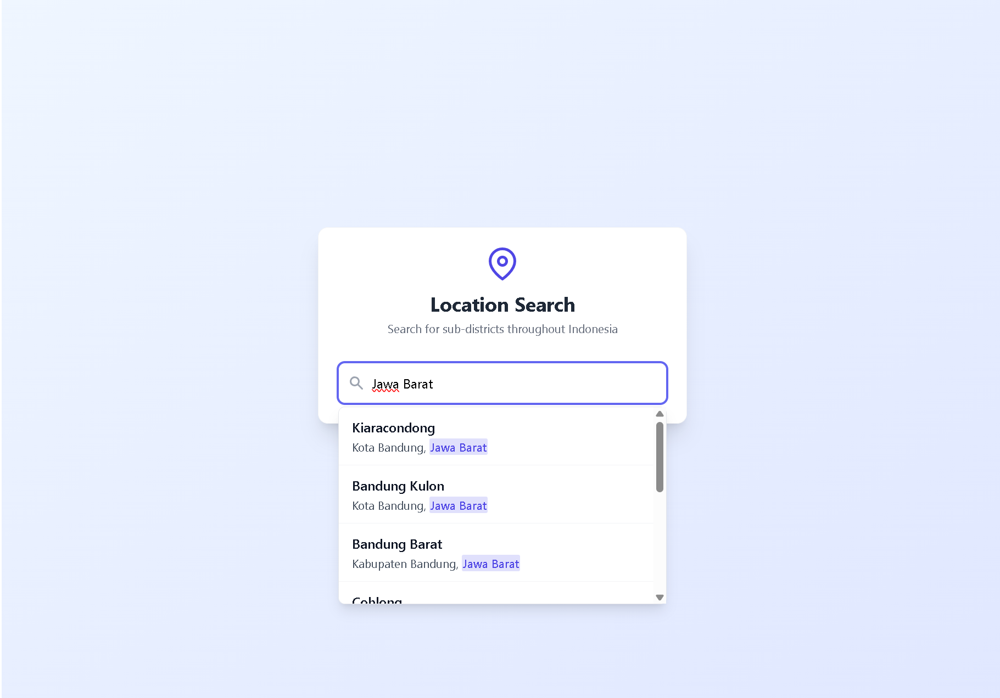
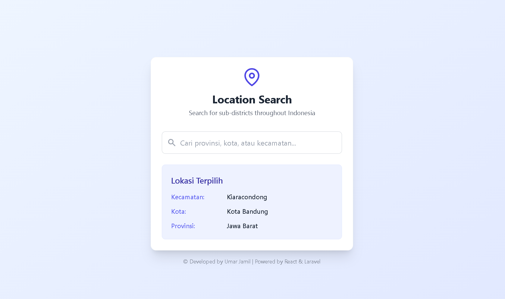
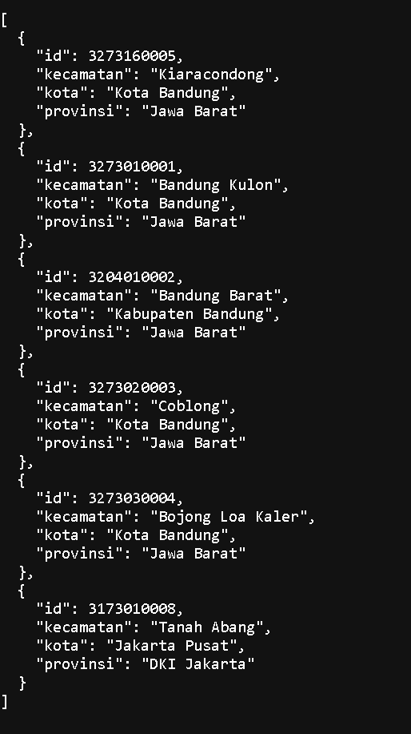

# District (Kecamatan) Search Application

A search application for Indonesian districts with autocomplete functionality. Users can type a location name (province, city, or district) and the application will display a list of relevant districts.

## How to Run the Application

### Prerequisites

- Docker and Docker Compose

### Steps

1. Clone this repository
2. Run the following command to start all services:

```bash
docker-compose up --build
```

3. Access the application:
   - Frontend: http://localhost:3000
   - Backend API: http://localhost:8000/api/locations?search=ban

## Screenshots

### Home Screen


### Search Results


### Selected Location


### API Response


## Features

- Real-time search with 300ms debounce
- Responsive search results in a dropdown
- Keyword highlighting in search results
- Selected location saved to localStorage
- Mobile-friendly UI with TailwindCSS
- Loading indicator during search

## Technologies

- **Backend**: PHP with a simple API endpoint
- **Frontend**: React (Vite), TailwindCSS
- **Deployment**: Docker + Docker Compose 